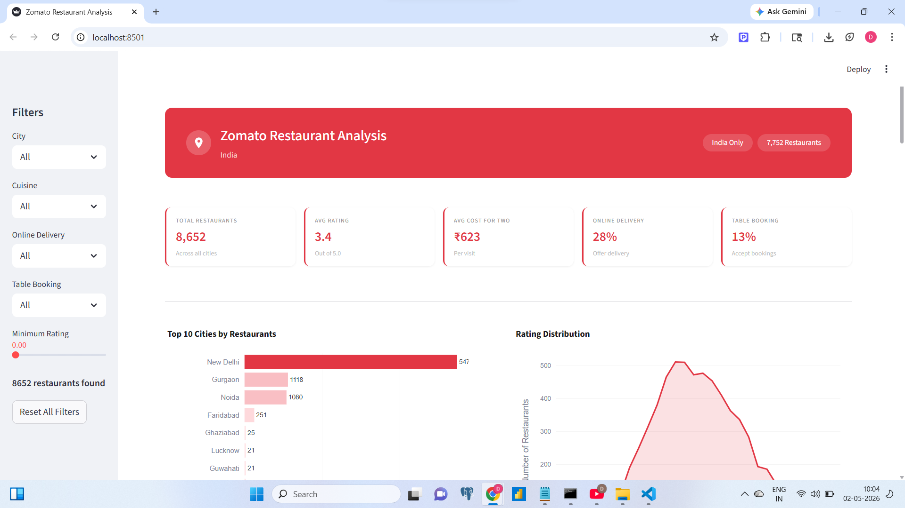

# 🍽️ Zomato India Restaurant Analysis Dashboard


> An industry-level interactive data analytics dashboard built with **Streamlit** and **Plotly** — analyzing 8,652 restaurants across India using real Zomato data.

---

## 📸 Dashboard Preview



---

## 🚀 Live Demo

👉 [View Live Dashboard](https://zomato-india-dashboard-whpcf5dtythlegqoabncaf.streamlit.app/)

---

## 📌 Project Highlights

- **8,652 restaurants** analyzed across major Indian cities
- **6 interactive charts** — Bar, Area, Lollipop, Donut, Bubble, Funnel
- **India Map** — click any city dot to filter the entire dashboard
- **5 KPI cards** — live updating based on filters
- **6 data-backed insights** derived from real analysis
- **Sidebar filters** — City, Cuisine, Delivery, Booking, Rating
- **Reset filter system** using session state counter approach

---

## 🛠️ Tech Stack

| Tool | Purpose |
|---|---|
| Python 3.13 | Core language |
| Streamlit 1.56 | Web app framework |
| Plotly / Plotly GO | Interactive charts |
| Pandas | Data manipulation |
| Power Query (Excel) | Data cleaning |

---

## 📂 Project Structure

```
zomato-dashboard/
│
├── app.py                  # Main Streamlit application
├── Zomato_data.csv         # Cleaned dataset
├── README.md               # Project documentation
└── requirements.txt        # Python dependencies
```

---

## 🧹 Data Cleaning Approach

Raw data was cleaned using **Microsoft Excel Power Query** before loading into Python:

### Steps followed in Power Query:
1. **Loaded** the raw Zomato global dataset
2. **Filtered only India** — removed all other countries using Country Code filter
3. **Removed unnecessary columns** — Address, Locality, Locality Verbose, Longitude, Latitude, Currency, Switch to order menu, Price range, Rating color, Country Code
4. **Kept only relevant columns:**
   - Restaurant ID, Restaurant Name, City, Cuisines
   - Average Cost for Two, Has Table Booking
   - Has Online Delivery, Aggregate Rating, Rating Text, Votes
5. **Removed blank rows** using Remove Blank Rows
6. **Saved as CSV** — `Zomato_data.csv`

---

## ⚙️ Session State Reset Approach

A key technical challenge was building a **Reset All Filters** button that properly resets all sidebar widgets.

### Problem:
Streamlit does not allow modifying a widget's value directly after it has been instantiated — this causes `StreamlitAPIException`.

### Solution — Reset Counter Trick:
```python
if "reset_count" not in st.session_state:
    st.session_state.reset_count = 0

rc = st.session_state.reset_count

city = st.sidebar.selectbox("City", city_list, key=f"city_{rc}")
```

Every time **Reset All Filters** is clicked, `reset_count` increases by 1 (0→1→2...). This creates **brand new widgets** with fresh keys like `city_0`, `city_1`, `city_2` — Streamlit treats them as completely new widgets with default values. No conflict, no errors.

```python
if st.sidebar.button("Reset All Filters"):
    st.session_state.reset_count += 1
    st.session_state.map_city = "All"
    st.rerun()
```

---

## 🗺️ Map as Interactive Slicer

The India map works as a **slicer** — clicking any city dot automatically updates the City filter in the sidebar and refreshes all charts.

### How it works:
1. Each city dot stores its name in `customdata`
2. On click, `session_state.map_city` is updated
3. `reset_count` increases — creating fresh widgets pre-selected with clicked city
4. `st.rerun()` refreshes the entire dashboard

---

## 📊 Charts & What They Show

| Chart | Type | Insight |
|---|---|---|
| Top 10 Cities | Horizontal Bar | New Delhi dominates with 5,473 restaurants |
| Rating Distribution | Area Chart | Most restaurants rate between 3.0–3.5 |
| Top 10 Cuisines | Lollipop Chart | North Indian leads with 936 restaurants |
| Delivery & Booking | Double Donut | Only 28% delivery, 13% table booking |
| Top 10 by Votes | Bubble Chart | Cost vs Rating vs Popularity |
| Rating Quality | Funnel Chart | Only 0.7% Excellent, 61.6% Average |
| City Distribution | India Map | Interactive city slicer |

---

## 🔍 Key Insights

1. **New Delhi dominates** India's food market with 5,473 restaurants — 5x more than any other city
2. **Most restaurants rate 3.0–3.5** — average quality is the norm across India
3. **North Indian is most popular** with 936 restaurants but only 3.2 avg rating
4. **Digital adoption gap** — only 28% delivery and 13% table booking across India
5. **Price ≠ Quality** — affordable restaurants frequently outscore expensive ones
6. **Excellence is rare** — only 0.7% of restaurants achieve Excellent rating in New Delhi

---

## 🏃 How to Run Locally

```bash
# Clone the repository
git clone https://github.com/charayadev/zomato-dashboard

# Install dependencies
pip install -r requirements.txt

# Run the app
python -m streamlit run app.py
```

---

## 📦 Requirements

```
streamlit==1.56.0
pandas
plotly
yfinance
```

---

## 👤 Author

**Dev Charaya**

[](https://github.com/charayadev)
[](https://www.linkedin.com/in/dev-charaya-186b40314/)

---

## ⭐ If you found this project useful, please give it a star!
